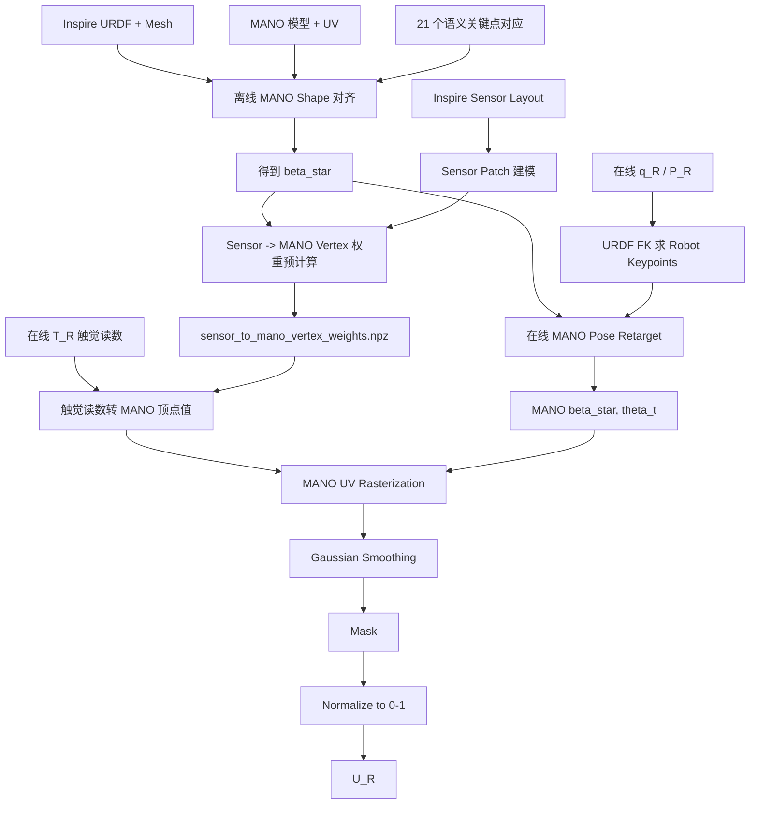

# Inspire 灵巧手触觉传感器投影到 MANO 的技术方案

> 基于论文 **UniTacHand: Unified Spatio-Tactile Representation for Human to Robotic Hand Skill Transfer** 中关于 Robotic Hand Tactile Data Projection、MANO UV Map、Robotic Hand Alignment 和 Post-processing 的描述整理。本文面向工程实现，将论文流程拆解为离线标定、在线姿态重定向、触觉投影、UV 光栅化和后处理五个部分。

---

## 1. 目标与核心思路

目标是将 Inspire 灵巧手上的原始触觉阵列读数投影到统一的 MANO UV 空间，得到机器人侧触觉图：

$$
T_R \in \mathbb{R}^{N_R} \quad \rightarrow \quad U_R \in \mathbb{R}^{W \times H}
$$

其中：

- $T_R$：Inspire 原始触觉读数，论文中机器人手为 1062 维阵列式压力传感器。
- $P_R$：机器人当前状态，包括手部 6-DoF pose 和 joint state。
- $U_R$：投影到 MANO UV 空间后的机器人触觉图。
- MANO mesh：作为统一 canonical surface，论文使用标准 MANO mesh，包含 778 个顶点和 1538 个面。
- UV 分辨率：论文附录使用 $1024 \times 1024$ 的 normalized 2D UV map。

整体映射链路为：

```text
Inspire 原始触觉阵列
  -> Inspire URDF 表面传感器区域
  -> 形态对齐后的 MANO 3D mesh
  -> MANO 2D UV map
  -> 平滑、mask、归一化后的统一触觉表示
```

这不是简单的传感器编号重排，而是一个 **几何对齐 + 姿态重定向 + 面片投影 + UV 光栅化** 的流程。

---

## 2. 总体架构



流程分为两个阶段：

1. **离线阶段**：完成 MANO shape 对齐、触觉 sensor patch 标定、sensor 到 MANO 顶点的投影权重预计算、UV mask 生成。
2. **在线阶段**：读取机器人当前关节状态和触觉数据，实时优化 MANO pose，将触觉值投影到 MANO mesh 并 rasterize 成 UV map。

---

## 3. 输入与输出定义

### 3.1 输入

| 名称 | 符号 | 说明 |
|---|---:|---|
| Inspire 触觉读数 | $T_R \in \mathbb{R}^{N_R}$ | 论文中 Inspire 为 1062 维触觉阵列 |
| Inspire 关节状态 | $q_R$ | 当前机器人手关节角 / joint state |
| 机器人位姿 | $P_R$ | 手部 6-DoF pose + joint state |
| Inspire URDF | - | 各 link 的几何与运动学关系 |
| Sensor layout | - | 每个触觉单元在 URDF 表面上的位置、面积、link 归属 |
| MANO model | $M(\beta, \theta)$ | MANO shape、pose、mesh faces、UV 坐标 |
| 关键点对应 | $K_R \leftrightarrow K_{MANO}$ | 21 个语义关键点对应关系 |

### 3.2 输出

| 名称 | 符号 | 说明 |
|---|---:|---|
| MANO 顶点触觉值 | $V_R \in \mathbb{R}^{778}$ | 每个 MANO 顶点上的压力值 |
| 原始机器人 UV 触觉图 | $U_R^{ori} \in \mathbb{R}^{W \times H}$ | rasterize 后的初始 UV map |
| 有效区域 mask | $M_R \in \{0,1\}^{W \times H}$ | Inspire 实际传感器覆盖区域 |
| 最终机器人 UV 触觉图 | $U_R \in \mathbb{R}^{W \times H}$ | 平滑、mask、归一化后的触觉图 |

---

## 4. 离线阶段一：MANO 与 Inspire 形态对齐

### 4.1 准备数据

需要准备：

1. **MANO 标准模型**
   - vertices：778
   - faces：1538
   - UV map
   - shape parameter $\beta$
   - pose parameter $\theta$

2. **Inspire URDF 几何**
   - link mesh
   - joint tree
   - reference pose 下的 mesh surface

3. **21 个语义关键点**
   - wrist
   - 各手指 MCP / PIP / DIP 或对应机器人关节关键点
   - 各 fingertip
   - 要保证语义一致，不建议只用最近点匹配

4. **表面采样点**
   - 从 Inspire URDF mesh 采样 4096 点
   - 从 MANO mesh 采样 4096 点

### 4.2 优化 MANO shape 参数

论文使用一次性 offline shape optimization，求解最适合机器人手形态的 MANO shape：

$$
\beta^* = \arg\min_{\beta} L_{align}
$$

其中：

$$
L_{align} = L_{CD} + w(t)L_{key}
$$

- $L_{CD}$：Chamfer Distance，用于表面对齐。
- $L_{key}$：21 个语义关键点的位置差。
- $w(t)$：关键点 loss 权重，随优化逐渐衰减。

附录中给出的工程参数：

```text
MANO vertices       : 778
MANO faces          : 1538
Robot surface points: 4096
MANO surface points : 4096
Optimization iters  : 10000
Keypoint weight     : w(t) = max(0, 1.0 - t / 2500)
```

### 4.3 优化伪代码

```python
mano = load_mano_model()
robot = load_inspire_urdf()

q_ref = get_reference_pose()
theta_ref = get_mano_reference_pose()

robot_pts = sample_urdf_surface(robot, q_ref=q_ref, n=4096)
robot_kpts = compute_robot_21_keypoints(robot, q_ref)

beta = init_mano_beta()
optimizer = Adam([beta], lr=lr)

for t in range(10000):
    mano_mesh = mano.forward(beta=beta, theta=theta_ref)
    mano_pts = sample_mesh_surface(mano_mesh, n=4096)
    mano_kpts = mano.get_21_keypoints(beta, theta_ref)

    loss_cd = chamfer_distance(robot_pts, mano_pts)
    loss_key = l2_loss(robot_kpts, mano_kpts)
    w = max(0.0, 1.0 - t / 2500.0)

    loss = loss_cd + w * loss_key
    optimizer.zero_grad()
    loss.backward()
    optimizer.step()

beta_star = beta.detach()
save(beta_star, "beta_star.pkl")
```

### 4.4 离线输出

```text
calibration/
  beta_star.pkl
  mano_reference_mesh_beta_star.obj
  robot_mano_keypoint_mapping.json
  robot_reference_pose.json
```

---

## 5. 离线阶段二：Inspire 触觉传感器建模

### 5.1 Sensor patch 表示

论文中机器人 tactile sensor 不是当作孤立点处理，而是 **model each sensor as a 2D area in the URDF**。工程上应将每个 sensor cell / sensor patch 表示成 URDF 某个 link 表面的二维区域。

推荐数据结构：

```python
@dataclass
class SensorPatch:
    sensor_id: int
    link_name: str
    polygon_vertices_local: np.ndarray  # [K, 3], link local frame
    polygon_uv_or_xy: np.ndarray        # [K, 2], optional local 2D layout
    center_local: np.ndarray            # [3]
    normal_local: np.ndarray            # [3]
    area: float
```

### 5.2 Sensor layout 标定

需要建立：

```text
sensor_id
  -> link_name
  -> local surface patch
  -> physical center / polygon / size
  -> nominal normal
```

如果厂商只提供触觉阵列编号和二维排布，需要额外完成 sensor layout calibration。建议优先保证以下区域的准确性：

- 拇指指腹
- 食指指腹
- 中指指腹
- 掌心
- 指尖区域

因为这些区域通常是抓取和接触任务中的高频接触区。

---

## 6. 离线阶段三：Sensor Patch 到 MANO 顶点的投影权重

### 6.1 推荐实现：采样点 + 最近面 + Barycentric 插值

论文只说明将 sensor 2D area 投影到优化后的 MANO mesh，并通过 weighted interpolation 将读数转移到对应 mesh vertices。工程落地时，推荐采用以下实现：

对每个 sensor patch：

1. 在 patch 内均匀采样 $K$ 个点，例如 $4 \times 4$ 或 $8 \times 8$。
2. 使用 Inspire reference pose 下的 FK，将采样点从 link local 坐标变换到 robot/world 坐标。
3. 在 $MANO(\beta^*, \theta_{ref})$ mesh 上查找最近三角面。
4. 将采样点投影到该三角面。
5. 计算 barycentric 坐标。
6. 将该 sensor 的读数按 barycentric 权重分配给三角面的三个顶点。
7. 对同一个 sensor 的所有采样点进行聚合，得到 sensor 到 MANO 顶点的稀疏权重。

### 6.2 稀疏投影矩阵

最终预计算一个稀疏矩阵：

$$
A_{sensor \rightarrow vertex} \in \mathbb{R}^{778 \times N_R}
$$

在线阶段只需：

$$
V_R(t) = A_{sensor \rightarrow vertex} T_R(t)
$$

其中 $V_R(t)$ 是 778 个 MANO 顶点的触觉值。

### 6.3 权重构造伪代码

```python
def build_sensor_to_mano_vertex_matrix(robot, sensor_layout, mano_mesh, q_ref):
    rows, cols, vals = [], [], []

    for sensor in sensor_layout:
        local_samples = sample_points_in_patch(sensor, samples_per_sensor=16)
        weight_accumulator = defaultdict(float)

        for p_local in local_samples:
            p_world = robot.fk_transform(sensor.link_name, q_ref) @ to_homo(p_local)
            p_world = from_homo(p_world)

            face_id, projected_p = nearest_face_projection(mano_mesh, p_world)
            v0, v1, v2 = mano_mesh.faces[face_id]
            l0, l1, l2 = barycentric(projected_p, mano_mesh.vertices[[v0, v1, v2]])

            weight_accumulator[v0] += l0 / len(local_samples)
            weight_accumulator[v1] += l1 / len(local_samples)
            weight_accumulator[v2] += l2 / len(local_samples)

        for vertex_id, w in weight_accumulator.items():
            rows.append(vertex_id)
            cols.append(sensor.sensor_id)
            vals.append(w)

    A = scipy.sparse.coo_matrix(
        (vals, (rows, cols)),
        shape=(778, len(sensor_layout))
    ).tocsr()
    return A
```

### 6.4 离线输出

```text
calibration/
  sensor_to_mano_vertex_weights.npz
  sensor_to_mano_faces.json
  sensor_valid_vertex_mask.npy
```

---

## 7. 在线阶段一：MANO Pose Retarget

### 7.1 读取机器人当前状态

每一帧输入：

```text
T_R[t] : Inspire 触觉阵列读数
q_R[t] : Inspire 当前关节状态
P_R[t] : 机器人手 6-DoF pose + joint state
```

### 7.2 Robot keypoints 计算

通过 URDF FK 得到当前机器人 21 个语义关键点：

$$
K_R(t) = FK_{Inspire}(q_R(t))
$$

### 7.3 固定 beta_star，优化当前 MANO pose

固定离线得到的 $\beta^*$，逐帧优化 MANO pose 参数 $\theta_t$：

$$
\theta_t^* = \arg\min_{\theta}
\sum_{j=1}^{21}
\left\|K^j_{MANO}(\beta^*, \theta) - K^j_R(q_R(t))\right\|_2^2
$$

论文附录说明在线模块使用 Adam 优化 $\theta$，逐帧最小化机器人当前 joint state 与 MANO model 的关键点差异。

### 7.4 实时优化建议

```text
初始化:
  theta_t init = theta_{t-1}

优化:
  Adam
  5~20 iterations / frame

可选正则:
  pose prior
  joint limit
  temporal smoothness
```

伪代码：

```python
def retarget_robot_to_mano(q_R, theta_prev, beta_star):
    robot_kpts = compute_robot_21_keypoints(robot, q_R)
    theta = theta_prev.clone().detach().requires_grad_(True)
    optimizer = Adam([theta], lr=retarget_lr)

    for _ in range(num_retarget_steps):
        mano_kpts = mano.get_21_keypoints(beta_star, theta)
        loss = ((mano_kpts - robot_kpts) ** 2).sum()

        optimizer.zero_grad()
        loss.backward()
        optimizer.step()

    return theta.detach()
```

---

## 8. 在线阶段二：触觉读数投影到 MANO Mesh

### 8.1 快速版：静态权重复用

在线直接使用离线预计算矩阵：

$$
V_R(t) = A_{sensor \rightarrow vertex} T_R(t)
$$

优点：

- 快速
- 稳定
- 适合实时控制

缺点：

- 传感器到 MANO 的几何关系固定在 reference pose 下
- 对极端姿态或局部偏差不够敏感

### 8.2 精确版：动态逐帧投影

每一帧根据当前 $q_R(t)$ 和 $MANO(\beta^*, \theta_t)$ 重新投影 sensor patch sample points。

优点：

- 几何更准确
- 对姿态变化更敏感

缺点：

- 计算成本高
- 实时控制中可能成为瓶颈

### 8.3 推荐工程取舍

建议默认使用：

```text
离线缓存 sensor -> MANO vertex 稀疏权重
在线更新 MANO pose
在线 rasterize 到 MANO UV
```

也就是：

- sensor 到 MANO 顶点的局部对应关系离线固定；
- MANO mesh pose 在线根据机器人关节状态更新；
- UV rasterization 每帧生成当前触觉图。

---

## 9. 在线阶段三：MANO 顶点值 Rasterize 到 UV 图

MANO mesh 有固定 faces 和 UV 坐标。给定每个顶点的触觉值 $V_R$，将其写入 UV 空间：

```text
for each MANO face f = (v1, v2, v3):
    uv_tri = (uv[v1], uv[v2], uv[v3])
    pressure_tri = (V_R[v1], V_R[v2], V_R[v3])
    rasterize uv_tri:
        texel_value = barycentric_interpolate(pressure_tri)
```

输出：

$$
U_R^{ori}(t) \in \mathbb{R}^{1024 \times 1024}
$$

伪代码：

```python
def rasterize_vertex_values_to_uv(faces, uv, vertex_values, resolution=(1024, 1024)):
    U = np.zeros(resolution, dtype=np.float32)
    W = np.zeros(resolution, dtype=np.float32)

    for face in faces:
        v0, v1, v2 = face
        tri_uv = uv[[v0, v1, v2]]
        tri_val = vertex_values[[v0, v1, v2]]

        pixels = pixels_inside_triangle(tri_uv, resolution)
        for px in pixels:
            l0, l1, l2 = barycentric_2d(px, tri_uv)
            val = l0 * tri_val[0] + l1 * tri_val[1] + l2 * tri_val[2]
            U[px] += val
            W[px] += 1.0

    valid = W > 0
    U[valid] /= W[valid]
    return U
```

---

## 10. 后处理：平滑、Mask、归一化

论文对 $U_R^{ori}$ 做三步后处理：

1. Gaussian smoothing，缓解 rasterization artifacts 和小幅几何对齐误差。
2. 乘以 robot tactile mask $M_R$，只保留真实传感器覆盖区域。
3. 归一化到 $[0, 1]$。

公式：

$$
U_R^{smooth} = Gaussian(U_R^{ori})
$$

$$
U_R = Normalize(U_R^{smooth} \odot M_R)
$$

论文附录参数：

```text
Gaussian kernel size: 5 x 5
Gaussian sigma      : 0.5
Normalize range     : [0, 1]
```

### 10.1 Mask 生成建议

$M_R$ 不应覆盖整个 MANO 手，而应只覆盖 Inspire 实际传感器投影区域：

```text
for each sensor patch:
    project patch to MANO mesh / UV
    rasterize covered texels
    set M_R[texel] = 1
optional:
    small dilation to tolerate alignment error
```

---

## 11. 端到端在线推理伪代码

```python
class InspireTactileToManoUV:
    def __init__(self, config):
        self.mano = load_mano_model(config.mano_path)
        self.robot = load_inspire_urdf(config.urdf_path)
        self.beta_star = load_pickle(config.beta_star_path)
        self.A = load_sparse_matrix(config.sensor_to_vertex_path)
        self.M_R = np.load(config.robot_uv_mask_path)
        self.theta_prev = init_mano_reference_pose()

    def step(self, T_R, q_R):
        # 1. online pose retargeting
        theta_t = retarget_robot_to_mano(
            q_R=q_R,
            theta_prev=self.theta_prev,
            beta_star=self.beta_star,
        )
        self.theta_prev = theta_t

        # 2. tactile vector -> MANO vertex pressure
        vertex_pressure = self.A @ T_R  # [778]

        # 3. current MANO mesh
        mano_mesh_t = self.mano.forward(beta=self.beta_star, theta=theta_t)

        # 4. rasterize vertex pressure to UV
        U_ori = rasterize_vertex_values_to_uv(
            faces=mano_mesh_t.faces,
            uv=self.mano.uv,
            vertex_values=vertex_pressure,
            resolution=(1024, 1024),
        )

        # 5. post-processing
        U_smooth = gaussian_filter(U_ori, sigma=0.5, kernel_size=5)
        U_masked = U_smooth * self.M_R
        U_R = normalize01(U_masked)

        return U_R, theta_t
```

---

## 12. 工程模块划分

| 模块 | 输入 | 输出 | 说明 |
|---|---|---|---|
| MANO 初始化 | MANO model 文件 | vertices、faces、UV | 固定 canonical surface |
| URDF 解析 | Inspire URDF / mesh | robot kinematic tree、link mesh | 用于 FK 和表面采样 |
| Sensor 标定 | sensor layout | sensor patch list | 每个 sensor 对应 URDF 表面区域 |
| Shape 对齐 | robot mesh、MANO、21 keypoints | $\beta^*$ | 离线优化机器人形态对应的 MANO shape |
| 投影权重预计算 | sensor patch、MANO($\beta^*$) | sparse matrix $A$ | sensor 读数到 MANO 顶点 |
| Pose retarget | $q_R(t)$ | $\theta_t$ | 在线优化 MANO pose |
| 顶点触觉计算 | $T_R(t)$、$A$ | $V_R(t)$ | 1062 维触觉转 778 顶点值 |
| UV rasterize | faces、UV、$V_R(t)$ | $U_R^{ori}$ | 顶点值转 2D UV 图 |
| 后处理 | $U_R^{ori}$、$M_R$ | $U_R$ | 平滑、mask、归一化 |

---

## 13. 推荐目录结构

```text
project/
  calibration/
    beta_star.pkl
    mano_reference_mesh_beta_star.obj
    robot_mano_keypoint_mapping.json
    inspire_sensor_layout.json
    sensor_to_mano_vertex_weights.npz
    mano_uv_valid_mask_robot.npy
    mano_uv_template_1024.png

  runtime/
    retarget_inspire_to_mano.py
    project_inspire_tactile_to_mano_uv.py
    rasterize_mano_uv.py
    postprocess_uv.py

  tools/
    visualize_sensor_layout.py
    visualize_sensor_to_mano_projection.py
    press_test_validate_projection.py

  configs/
    inspire_mano_projection.yaml
```

---

## 14. 配置文件示例

```yaml
mano:
  model_path: assets/MANO_RIGHT.pkl
  uv_path: assets/mano_uv.npy
  resolution: [1024, 1024]

robot:
  urdf_path: assets/inspire_hand/inspire.urdf
  reference_pose_path: calibration/robot_reference_pose.json
  keypoint_mapping_path: calibration/robot_mano_keypoint_mapping.json

calibration:
  beta_star_path: calibration/beta_star.pkl
  sensor_layout_path: calibration/inspire_sensor_layout.json
  sensor_to_vertex_path: calibration/sensor_to_mano_vertex_weights.npz
  robot_uv_mask_path: calibration/mano_uv_valid_mask_robot.npy

shape_alignment:
  num_surface_points: 4096
  num_iterations: 10000
  keypoint_weight_schedule: linear_decay
  keypoint_decay_steps: 2500

retarget:
  optimizer: Adam
  steps_per_frame: 10
  lr: 0.01
  use_temporal_init: true
  use_pose_prior: true

projection:
  samples_per_sensor: 16
  nearest_face_backend: trimesh
  interpolation: barycentric
  mode: static_sparse_matrix

postprocess:
  gaussian_kernel_size: 5
  gaussian_sigma: 0.5
  normalize: true
  mask_dilation: 1
```

---

## 15. 验证方案

### 15.1 几何对齐验证

检查 $MANO(\beta^*)$ 与 Inspire reference mesh 是否对齐：

- wrist 位置是否一致
- 五指长度是否匹配
- 指尖是否对应正确
- 掌心宽度是否近似
- Chamfer distance 是否收敛
- 21 个 keypoints 是否无语义错配

### 15.2 Sensor 投影验证

对每个 sensor patch 可视化：

```text
sensor_id -> URDF 表面区域 -> MANO mesh 区域 -> MANO UV 区域
```

建议输出：

```text
debug/sensor_projection_overview.html
debug/sensor_projection_uv.png
```

### 15.3 实物按压验证

逐区按压真实 Inspire 手：

| 按压区域 | 期望 UV 激活区域 |
|---|---|
| 拇指指腹 | MANO thumb distal / pulp 区域 |
| 食指指尖 | MANO index fingertip 区域 |
| 中指指腹 | MANO middle finger pulp 区域 |
| 掌心 | MANO palm 区域 |
| 小指侧面 | MANO pinky / lateral 区域 |

验证重点：

- 是否激活正确手指
- 是否落在正确指节
- 是否存在左右翻转
- 是否存在指尖/指根错位
- 是否存在掌心和手指串扰

---

## 16. 关键风险与规避策略

### 16.1 Sensor layout 不准

**风险**：1062 个触觉单元在 URDF 表面的物理位置不准，会直接导致 UV 激活位置错误。

**规避**：

- 建立 sensor_id 到 link surface patch 的标定表。
- 做实物按压验证。
- 对高频接触区域做单独校准。

### 16.2 关键点语义不一致

**风险**：21 个 keypoints 如果语义错配，MANO shape 和 pose retarget 都会偏。

**规避**：

- 人工审核 keypoint mapping。
- 每个关键点保存名称而非只保存 index。
- 关键点可视化检查。

### 16.3 UV mask 过窄或过宽

**风险**：

- 过窄会裁掉真实接触。
- 过宽会引入无传感器区域噪声。

**规避**：

- 以 sensor 投影区域为基础生成 mask。
- 做小幅 dilation。
- 结合实物按压数据修正。

### 16.4 动态姿态下局部误差

**风险**：离线静态投影权重在极端姿态下可能有偏差。

**规避**：

- 实时控制使用静态稀疏矩阵。
- 离线数据处理或高精度评估使用动态投影。
- 对指尖和掌心等关键区域提高采样密度。

---

## 17. 论文流程与工程实现对应表

| 论文描述 | 工程实现 |
|---|---|
| MANO UV map 作为统一表面空间 | 使用 MANO mesh + UV 作为 canonical tactile surface |
| known URDF model | 解析 Inspire URDF、mesh、FK |
| predefined geometry of tactile sensors | 标定 1062 个 sensor patch 的 link 和表面区域 |
| one-time optimization for $\beta^*$ | 离线优化 MANO shape |
| $L_{align}=L_{CD}+w(t)L_{key}$ | Chamfer surface alignment + 21 keypoint loss |
| frame-by-frame retargeting for $\theta$ | 在线 Adam 优化 MANO pose |
| model each sensor as a 2D area in URDF | sensor patch 多点采样 |
| weighted interpolation to mesh vertices | barycentric 权重聚合成稀疏矩阵 |
| robotic tactile UV map $U_R^{ori}$ | rasterize MANO vertex pressure 到 UV |
| Gaussian smoothing + binary mask + normalization | $5 \times 5, \sigma=0.5$ 平滑，乘 $M_R$，归一化到 $[0,1]$ |

---

## 18. 最小可行版本 MVP

建议先实现一个 MVP：

```text
1. 手工建立 1062 sensor layout 的初版映射
2. 离线优化 beta_star
3. 离线构建 sensor_to_mano_vertex sparse matrix
4. 在线直接 A @ T_R 得到 MANO 顶点触觉
5. rasterize 到 1024 x 1024 UV
6. Gaussian smoothing + mask + normalize
7. 用实物按压验证投影是否正确
```

MVP 中可以暂时不做动态逐帧投影，只保留在线 MANO pose retarget 和 UV 可视化。

---

## 19. 一句话总结

UniTacHand 中 Inspire 触觉到 MANO 的投影，本质是：先用 Inspire URDF mesh 和 21 个语义关键点离线优化出适配机器人形态的 MANO shape $\beta^*$，再把 Inspire 的每个触觉传感器建模为 URDF 表面的 2D 面片，通过 weighted interpolation 投到 MANO mesh 顶点，在线根据机器人 joint state 重定向 MANO pose，最后将顶点触觉值 rasterize 到 MANO UV，并经过 Gaussian smoothing、valid mask 和归一化得到统一触觉图 $U_R$。

---

## 20. 参考来源

- `25-12-UniTacHand.md`，Section 3.1：Unified Representation via MANO UV Maps。
- `25-12-UniTacHand.md`，Section 4.1：Experimental Setup，Inspire tactile hand 硬件配置。
- `25-12-UniTacHand.md`，Appendix A.1：MANO Model Configuration、Robotic Hand Alignment、Post-processing。
- 本文中关于“采样点 + 最近面 + barycentric 插值”的部分是对论文 weighted interpolation 描述的工程化落地建议，论文未给出该插值实现的全部代码细节。
